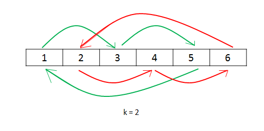

# 189. 旋转数组
难度：中等

给定一个数组，将数组中的元素向右移动 k 个位置，其中 k 是非负数。

# 进阶：
尽可能想出更多的解决方案，至少有三种不同的方法可以解决这个问题。
你可以使用空间复杂度为 O(1) 的 原地 算法解决这个问题吗？
 
# 示例
## 示例 1:

### 输入: 
nums = [1,2,3,4,5,6,7], k = 3
### 输出: 
[5,6,7,1,2,3,4]
### 解释:
- 向右旋转 1 步: [7,1,2,3,4,5,6]
- 向右旋转 2 步: [6,7,1,2,3,4,5]
- 向右旋转 3 步: [5,6,7,1,2,3,4]

## 示例 2:

### 输入：
nums = [-1,-100,3,99], k = 2
### 输出：
[3,99,-1,-100]
### 解释: 
- 向右旋转 1 步: [99,-1,-100,3]
- 向右旋转 2 步: [3,99,-1,-100]
 

# 提示：
- 1 <= nums.length <= 2 * 104
- -231 <= nums[i] <= 231 - 1
- 0 <= k <= 105

# 解答
|方法|要点|时间复杂度|空间复杂度|
|---|---|---|---|
|方法一|使用辅助数组||
## 方法一
使用辅助数组，将i号元素移至(i+k)%l(l为数组长度)位置

## 方法二
使用辅助数组，先将$l-(k\%l) \sim l-1$位置的元素复制至辅助数组，再将$0 \sim (k\%l)-1$ 号元素移动至$k \sim l-1位置$，最后将辅助数组中的元素复制至$0 \sim k-1位置$

## 方法三

## 方法四
拆分成三步：
1. 整体翻转数组 [7，6，5，4，3，2，1]
2. 以k索引为界限 翻转前半段 [5，6，7，4，3，2，1]
3. 再翻转后半段 [5，6，7，1，2，3，4]
见rotate4 
时间复杂度$O(n)$ 空间复杂度$O(1)$
## 方法五
将每一次替换形成一个闭环

方法一中使用额外数组的原因在于如果直接将每个数字放至它最后的位置，这样被放置位置的元素会被覆盖从而丢失。因此，从另一个角度，可以将被替换的元素保存在变量 $temp$ 中，从而避免了额外数组的开销。

从位置 0 开始，最初令 $temp=nums[0]$。根据规则，位置 0 的元素会放至 $(0+k) \% n$ 的位置，令 $x=(0+k)\%n$，此时交换 $temp$ 和 $nums[x]$，完成位置 $x$ 的更新。

然后，考察位置 $x$，并交换 $temp$ 和 $nums[(x+k)\%n]$，从而完成下一个位置的更新。不断进行上述过程，直至回到初始位置 0。

容易发现，当回到初始位置 0 时，有些数字可能还没有遍历到，此时应该从下一个数字开始重复的过程，可是这个时候怎么才算遍历结束呢？不妨先考虑这样一个问题：从 0 开始不断遍历，最终回到起点 0 的过程中，遍历了多少个元素？

由于最终回到了起点，故该过程恰好走了整数数量的圈，不妨设为 a 圈；再设该过程总共遍历了 b 个元素。因此，有 $an=bk$，即 $an$ 一定为$ n,k$ 的公倍数。又因为在第一次回到起点时就结束，因此 $a$ 要尽可能小，故 $an$ 就是 $n,k$ 的最小公倍数 $lcm(n,k)$，因此 $b$ 就为 $lcm(n,k)/k$。

这说明单次遍历会访问到 $lcm(n,k)/k$个元素。为了访问到所有的元素，需要进行遍历的次数为

$$
\frac{n}{lcm(n,k)/k}=\frac{nk}{lcm(n,k)}=gcd(n,k)
$$
其中 $gcd$ 指的是最大公约数。

示例如下

nums = [1, 2, 3, 4, 5, 6]  
k = 2
